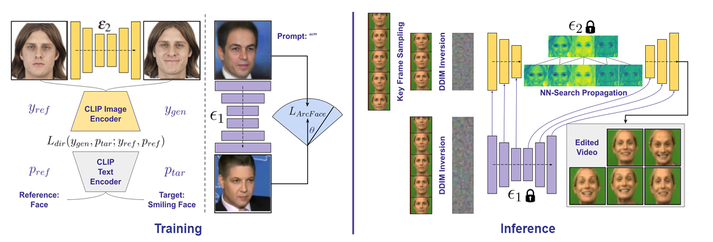

# IP-FaceDiff(WACV 2024)




## Setup
```
conda create -n ipfacediff python=3.9
conda activate ipfacediff
pip install -r requirements.txt
```
## Weights and test videos
```
# Download weights from https://drive.google.com/file/d/10sfu8DQAAREGHB22lmRlsmiFSeaYazKl/view?usp=drive_link  and place in weights/
# Place shape extractor models from https://drive.google.com/file/d/10udhYxUdSnT1qbGIm9064YBBszvnJ1U-/view?usp=drive_link and place in weights/
# Place test videos in assets/videos/ 
```

IP-FaceDiff is designed for video for structure-preserving edits.
Our method is built on top of an image editing technique (e.g., Plug-and-Play,ControlNet).
To edit your video, first create a yaml config as in configs/config_pnp.yaml. Then run the inference.
## Inference
```

python inference.py

```
